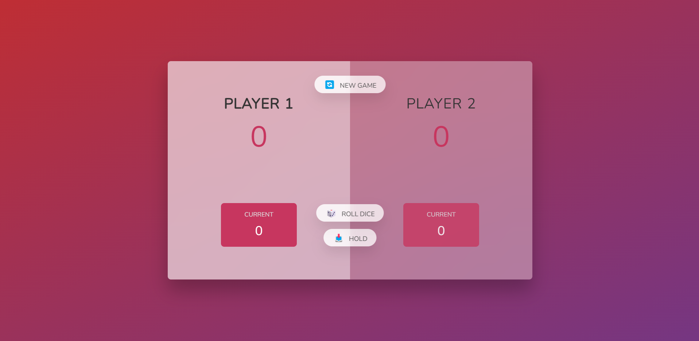

## Project Description

In this project, I aimed to create a web application that simulates the Pig Game, where two users can roll dice and try to gain scores. The technologies used in this project include:

- HTML: Structured the content and layout of the web application.
- CSS: Styled the web page to provide a visually appealing and user-friendly interface.
- JavaScript: Implemented the game logic, including dice rolls, score accumulation, and turn management.
- DOM Manipulation: Utilized to dynamically update the game state and interact with HTML elements.
- Class Management: Added and removed classes to HTML elements to reflect the current game state, such as active player indication and winner announcement.
